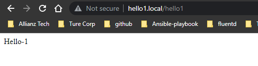
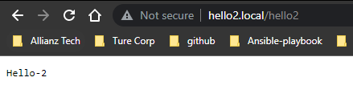
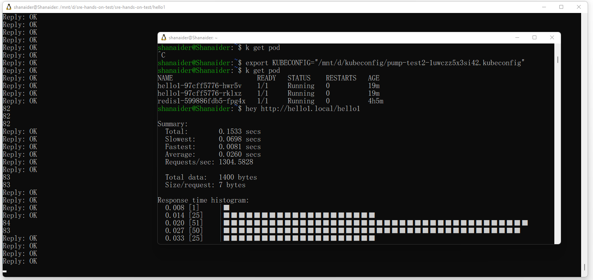
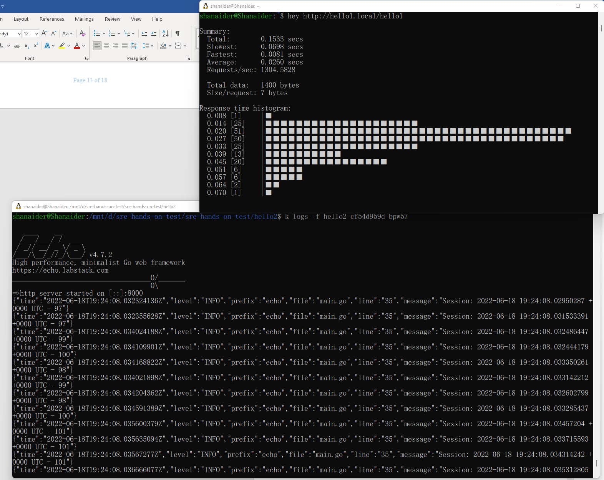
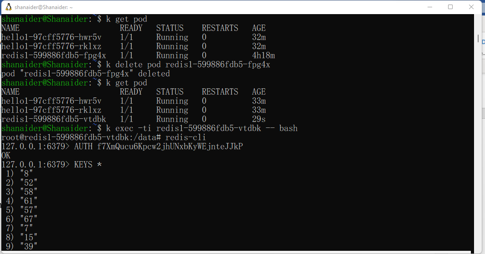
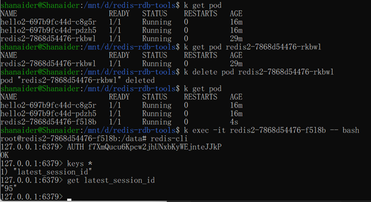
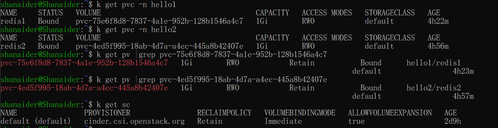

# example
There are 2 simple applications doing similar thing. One is written in NodeJS and another in Golang.

Both require working Redis server to keep session & timestamp.


## Installation ##

## hello-1 ##

```
npm install express
npm install redis

export port=redis_port
export host=redis_host
export password=redis_password

node hello1/hello-1.js
```

## hello-2 ##

```
cd hello2

go mod download

export REDIS_HOST="localhost:6379"
export REDIS_PASSWORD="password"
export REDIS_DB="0"

go run main.go
```

---
# Update Session
# how to build images
## nodejs
```
npm init
npm install express
npm install redis@3.1.2
docker build -t line-hello-1 .
docker tag line-hello-1 thanaphat1991/line-hello-1
docker push thanaphat1991/line-hello-1
```
Note: I'm facing on your code with redis@4.1.0,so I downgrade that redis to v3.1.2 because i tried to migrate to 4.x but didn't work,

##golang
```
go init 
go mod download
docker build -t line-hello-2 .
docker tag line-hello-2 thanaphat1991/line-hello-2
docker push thanaphat1991/line-hello-2
```

# How to deploy
```
k create ns hello1
kns hello1
k create -f hello1.yaml
k create -f hello1-svc.yaml
k create -f hello1-ing.yaml
```

```
k create ns hello2
kns hello2
k create -f hello2.yaml
k create -f hello2-svc.yaml
k create -f hello2-ing.yaml
```

# How to test

Maphost ingress hostname with EIP
```
45.125.128.46	hello1.local hello2.local
```

Testing on my browser





Testing with hey and tail the log.

#hello1
```
k logs -f hello1-97cff5776-hwr5v
Hello-1 listening on port 8000!


Redis client connected
Redis client connected
Redis client connected
Redis client connected
Redis client connected
Redis client connected
Redis client connected
41
41
41
Redis client connected
```


#hello2
```
 k logs -f hello2-cf54d959d-bpw57

   ____    __
  / __/___/ /  ___
 / _// __/ _ \/ _ \
/___/\__/_//_/\___/ v4.7.2
High performance, minimalist Go web framework
https://echo.labstack.com
____________________________________O/_______
                                    O\
⇨ http server started on [::]:8000
{"time":"2022-06-18T19:24:08.032324136Z","level":"INFO","prefix":"echo","file":"main.go","line":"35","message":"Session: 2022-06-18 19:24:08.02950287 +0000 UTC - 97"}
{"time":"2022-06-18T19:24:08.032355628Z","level":"INFO","prefix":"echo","file":"main.go","line":"35","message":"Session: 2022-06-18 19:24:08.031533391 +0000 UTC - 97"}
{"time":"2022-06-18T19:24:08.034024188Z","level":"INFO","prefix":"echo","file":"main.go","line":"35","message":"Session: 2022-06-18 19:24:08.032486447 +0000 UTC - 99"}
{"time":"2022-06-18T19:24:08.034109901Z","level":"INFO","prefix":"echo","file":"main.go","line":"35","message":"Session: 2022-06-18 19:24:08.032444179 +0000 UTC - 100"}
```



# Extra points  if Redis can keep state after container restart

#hello1
```
k get pod
NAME                      READY   STATUS    RESTARTS   AGE
hello1-97cff5776-hwr5v    1/1     Running   0          30m
hello1-97cff5776-rklxz    1/1     Running   0          30m
redis1-599886fdb5-fpg4x   1/1     Running   0          4h16m
shanaider@Shanaider:~$ k exec -ti redis1-599886fdb5-fpg4x -- bash
root@redis1-599886fdb5-fpg4x:/data# redis-cli
127.0.0.1:6379> AUTH f7XmQucu6Kpcw2jhUNxbKyWEjnteJJkP
OK
127.0.0.1:6379> KEYS *
 1) "86"
 2) "3"
 3) "36"
 4) "11"
 5) "71"
 6) "66"
 7) "60"
 8) "67"
 9) "41"
10) "57"
11) "68"
12) "21"
13) "53"
14) "79"
15) "25"
16) "78"
17) "62"
18) "61"
19) "17"
20) "77"
21) "59"
22) "37"
23) "13"
24) "44"
25) "26"
26) "52"
27) "50"
28) "8"
29) "82"
30) "81"
31) "32"
32) "40"
33) "6"
34) "14"
35) "72"
36) "80"
37) "30"
38) "47"
39) "48"
40) "85"
41) "69"
42) "42"
43) "5"
44) "16"
45) "35"
46) "19"
47) "74"
48) "20"
49) "4"
50) "64"
51) "83"
52) "24"
53) "2"
54) "9"
55) "22"
56) "34"
57) "84"
58) "31"
59) "23"
60) "73"
61) "51"
62) "56"
63) "39"
64) "63"
65) "27"
66) "7"
67) "43"
68) "46"
69) "55"
70) "18"
71) "1"
72) "33"
73) "49"
74) "28"
75) "75"
76) "lastest_session_id"
77) "10"
78) "54"
79) "12"
80) "29"
81) "58"
82) "15"
83) "65"
84) "38"
85) "70"
86) "45"
87) "76"
127.0.0.1:6379> get lastest_session_id
"86"
127.0.0.1:6379>
```

```
k get pod
NAME                      READY   STATUS    RESTARTS   AGE
hello1-97cff5776-hwr5v    1/1     Running   0          32m
hello1-97cff5776-rklxz    1/1     Running   0          32m
redis1-599886fdb5-fpg4x   1/1     Running   0          4h18m

k delete pod redis1-599886fdb5-fpg4x
pod "redis1-599886fdb5-fpg4x" deleted


k get pod
NAME                      READY   STATUS    RESTARTS   AGE
hello1-97cff5776-hwr5v    1/1     Running   0          33m
hello1-97cff5776-rklxz    1/1     Running   0          33m
redis1-599886fdb5-vtdbk   1/1     Running   0          29s


```



#hello2




# Storage class / pv /pvc
